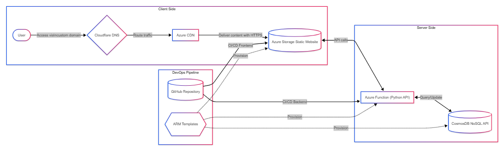

# Cloud Resume Challenge - Azure Implementation

## Project Overview
This repository contains my implementation of the [Cloud Resume Challenge](https://cloudresumechallenge.dev/docs/the-challenge/azure/) on Microsoft Azure. The project demonstrates a comprehensive set of cloud and DevOps skills by deploying a personal resume website with a visitor counter using modern cloud architecture principles.



## Features
- Static website hosted on Azure Storage
- HTTPS secured via Azure CDN
- Custom domain name configuration with Cloudflare DNS
- Interactive visitor counter using JavaScript
- Serverless backend API built with Azure Functions
- Data persistence using Azure CosmosDB (NoSQL API)
- Infrastructure as Code (IaC) using ARM templates
- CI/CD pipelines with GitHub Actions for both frontend and backend

## Architecture
The solution follows a modern serverless architecture:

1. **Frontend**:
   - Resume built with HTML/CSS/JavaScript
   - Hosted on Azure Storage Static Website
   - Delivered via Azure CDN with HTTPS encryption
   - Custom domain configured through Cloudflare DNS

2. **Backend**:
   - Azure Function (Python) providing a REST API
   - CosmosDB NoSQL storage for the visitor counter
   - All resources deployed using ARM templates

3. **DevOps**:
   - Source control via GitHub
   - Automated deployments through GitHub Actions
   - Infrastructure as Code for all cloud resources
   - Automated testing for backend functionality

## Repository Structure
```
├── .github/workflows/             # GitHub Actions CI/CD
├── frontend/                      # Frontend code
│   ├── css/                       # CSS styling
|   ├── images/                    # Images
│   ├── js/                        # JavaScript for visitor counter
│   ├── index.html                 # Resume HTML
│   └── error_404.html
│
├── backend/
│   └── api/
│       ├── function_app.py        # Backend code
│       ├── host.json              # Functions host configuration
│       ├── tests/                 # Python tests
|       |   ├── test_api.py
|       |   ├── test_api_2.py
|       |   ├── test_security.py
|       |   └── test_ui.py
|       |
│       └── requirements.txt
│
│
└── README.md                      # This file
```

## Technologies Used
- **Frontend**: HTML5, CSS3, JavaScript
- **Backend**: Python, Azure Functions, Azure SDK
- **Database**: Azure CosmosDB (NoSQL API)
- **Infrastructure**: ARM templates
- **DevOps**: GitHub Actions, Git
- **Cloud Provider**: Microsoft Azure (Storage, Functions, CosmosDB, CDN), Cloudflare DNS

## Deployment
The entire solution is deployed automatically through GitHub Actions workflows:

1. **Backend Deployment**:
   - Triggered on pushes to the backend repository
   - Runs Python tests
   - Deploys ARM templates to provision/update Azure resources
   - Deploys Azure Functions code

2. **Frontend Deployment**:
   - Triggered on pushes to the frontend repository
   - Uploads website files to Azure Storage
   - Purges Azure CDN to refresh content

## Learning Outcomes
Through this project, I've demonstrated proficiency in:
- Building and deploying static websites
- Implementing serverless architectures
- Writing backend APIs
- Setting up and connecting to databases
- Configuring DNS and HTTPS
- Applying Infrastructure as Code principles
- Establishing CI/CD pipelines
- Writing and running automated tests
- Working with cloud services and SDKs

## Future Improvements
- Add more interactive elements to the resume
- Implement a blog section using a static site generator
- Set up monitoring and alerting
- Add a contact form with email notification
- Implement usage analytics

## Contact Information
Feel free to reach out if you have any questions about this project:
- salviraj123@outlook.com

